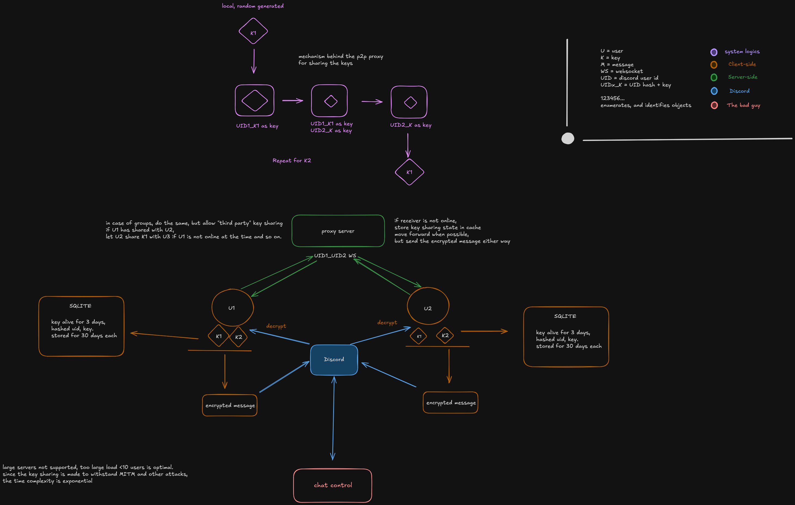

# Architecture

*This describes the current design, written before the code. Specifics may still change; the core architecture is less likely to. See [Status](README.md#status) in the main README.*

Technical deep-dive into how NOCC actually works. If you just want to use it, see [`INSTALL.md`](INSTALL.md). If you want to hack on it, start here.

## Overview

 

The relay only ever routes small encrypted handshake payloads between two hashed IDs, and keeps a minimal Postgres record of which hashed IDs have ever registered. It never touches Discord's infrastructure directly, and it never sees an actual chat message. Discord carries whatever ciphertext the extension hands it, same as any other message.

## The handshake, in detail

Before two users can exchange encrypted messages in a given channel, they need to trade keys, without ever relying on a pre-shared secret or a certificate authority. NOCC does this with **Shamir's three-pass protocol**: a way to move a secret from one party to another across an untrusted channel using only commutative encryption, where neither side needs to know anything about the other in advance beyond how to reach them (their hashed UID).

Each key belongs to exactly one user in exactly one channel. It is never combined or derived into a separate shared secret. K1 encrypts only U1's messages in this channel; K2 encrypts only U2's messages in this channel. Delivering each key takes its own three-pass exchange, run twice, once per direction, six passes total per rotation. All six passes travel over a single opaque `handshake` event; the relay just forwards whatever payload arrives to the room matching its `to` field and never inspects the contents.

**Deriving each user's pad**
Before sending, each user derives a one-time encryption pad from their own hashed UID and the key they're about to send: `e1 = SHA256(uid_hash_U1 + K1)` for U1, `e2 = SHA256(uid_hash_U2 + K2)` for U2. Because K1 and K2 are freshly generated on every rotation, this pad is different every time, even between the same two users. Deriving it from the UID hash alone would mean reusing the same pad across every exchange that user ever makes, which is exactly the kind of one-time-pad reuse that breaks this style of encryption; tying it to the specific key being sent avoids that.

**Delivering K1 (U1 to U2)**
1. U1 encrypts K1 with their own pad, `E1(K1) = K1 XOR e1`, and sends `{ to: hash(U2_uid), channel, pass: 1, data: E1(K1) }` over `handshake`. The relay forwards it to whichever socket is in the room named `hash(U2_uid)`. If U2 isn't online, there's nothing to forward into; there's no queue or store-and-forward, U2 needs to be connected for a fresh attempt.
2. U2 can't unwrap `E1(K1)` without `e1`, so instead layers their own pad on top: `E2(E1(K1))`, and sends it back to U1.
3. U1 removes their own layer (XOR is self-inverse, so applying `e1` again cancels it): `E2(E1(K1)) XOR e1 = E2(K1)`, and sends that back to U2.
4. U2 removes their own layer the same way, recovering `K1`.

**Delivering K2 (U2 to U1)**
The same four steps run in the opposite direction, reusing the same `e1`/`e2` pads already established for this rotation: U2 sends `E2(K2)`, U1 layers `E1(E2(K2))` on top, U2 strips their own layer back down to `E1(K2)`, and U1 strips their own layer to recover `K2`.

At the end of both exchanges, both sides hold both `K1` and `K2` for this channel. Each is used one-directionally: U1's messages are always encrypted with K1 and decrypted by whoever holds K1; U2's messages are always encrypted with K2 and decrypted by whoever holds K2. Compromising one user's key doesn't expose the other user's messages, and the relay never saw a plaintext key at any point, only XOR-masked blobs it has no way to unwrap.

## Key lifecycle: rotation and history

Keys aren't permanent. Each per-(user, channel) key is generated fresh and:

- Is the **active** key for **3 days** from creation, used to encrypt that user's new outgoing messages in that channel.
- After 3 days, it stops being used for new messages (a new handshake generates and exchanges a replacement), but is kept as a **history** key for a further **30 days** (33 days total from creation) so older messages in that channel remain readable.
- After 33 days, the key and its timestamp are deleted from IndexedDB. Any message still encrypted under it becomes permanently unreadable at that point.

This periodic rotation means a key compromised today cannot decrypt messages sent under a different key generated three-plus days later, and it bounds how far back a compromised key can reach into history to 33 days. It is not full per-message forward secrecy (a compromised active key still exposes everything encrypted under it during its 3-day active window), but it meaningfully limits the blast radius compared to a single static key used forever. See [`SECURITY.md`](SECURITY.md#known-limitations) for the honest limits of this.

## Encryption flow (message → encrypt → send → decrypt)

1. You type a message into Discord's input box, normally.
2. The extension's content script listens for the send event (intercepting before Discord's own submit handler completes).
3. If you have an active key for this channel (handshake already completed, key still inside its 3-day active window), the plaintext is encrypted with AES-256-GCM using that key, and the ciphertext (base64/hex-encoded) is substituted as the actual message body Discord sends.
4. Discord's servers receive, store, and deliver the ciphertext exactly like any other message. They have no idea it's encrypted; it's just a string to them.
5. On the recipient's side, the extension watches the DOM for new message nodes. It recognizes NOCC ciphertext (a recognizable payload marker/prefix), looks up the sender's key for that channel in IndexedDB (active or archived, whichever covers the message's timestamp), decrypts it, and replaces the rendered text node with the plaintext, in place, client-side, after Discord has already rendered its version.
6. If no key exists yet for this sender/channel (no handshake completed, or the relevant key already aged out past 33 days), the message is shown as-is: plaintext goes out unencrypted if you have no active key, and old ciphertext that's aged out simply can't be decrypted anymore.

## UID hashing

Real Discord user IDs never touch the relay or the database. Before registering with the relay or addressing a handshake to someone, the extension computes:

```
uid_hash = SHA256(uid + SALT + PEPPER)
```

- `SALT` is a shared secret configured per-relay-deployment. Everyone using the same relay needs the same `SALT` so their hashes are computed identically and can find each other.
- `PEPPER` is optional and deliberately kept separate from `SALT` (e.g. not stored in the same config file/secrets store), a second layer that, even if `SALT` leaks, still needs to be known separately to recompute valid hashes.
- This isn't meant to be unbreakable cryptographic anonymity. Someone who already knows a target's real UID can compute the same hash if they also know `SALT`/`PEPPER`. It's meant to keep the relay operator, and anyone observing relay traffic or the database, from casually reading off who's talking to whom without already having that information.

## Relay server internals

The relay is a single Node.js process running Socket.io, plus a thin PostgreSQL connection for one thing only: remembering which hashed UIDs have registered.

Routing needs no separate bookkeeping. On `register`, the server does two things:

```js
socket.join(uid_hash);
await db.query(
  'INSERT INTO known_users (uid_hash, first_seen) VALUES ($1, now()) ON CONFLICT DO NOTHING',
  [uid_hash]
);
```

From then on, forwarding a handshake payload is just:

```js
io.to(payload.to).emit(event, payload);
```

Socket.io's own room membership does the work a manual `Map` used to do. When a socket disconnects, Socket.io removes it from its rooms automatically, no cleanup code required.

The `known_users` table is the only thing that survives a restart. It has exactly two columns: `uid_hash` and `first_seen`. No per-connection logs, no last-seen timestamps, no record of who talked to whom. It answers exactly one question: has this hashed UID ever registered with this relay? Nothing else.

## Extension internals

- **DOM injection:** a content script (`content.js` or similar) is injected into `discord.com` pages via the manifest's `content_scripts` entry, running after Discord's own JS has mounted the page.
- **Event listening:** the script attaches listeners to Discord's message input (intercepting the send action) and uses a `MutationObserver` on the message list container to catch newly rendered messages as they appear, so it can decrypt them in place without needing to poll.
- **Key storage:** keys live in IndexedDB, not `chrome.storage.local`, since each channel can accumulate many keys over time (one active plus up to ten archived per user, given the 3-day/33-day cycle) and IndexedDB handles that volume and querying by timestamp far better. Each record is keyed by channel and owning user, and stores the key material plus its creation timestamp. A periodic cleanup pass deletes anything past the 33-day mark.
- **No Discord API usage:** NOCC does not use Discord's official API or bot infrastructure at all. Everything happens by reading and writing the same DOM and network calls the Discord web client itself produces. This is why it's fragile to Discord frontend changes (see [Design decisions and tradeoffs](#design-decisions-and-tradeoffs)) but also why it requires no API key, no bot approval, and no cooperation from Discord whatsoever.

## Design decisions and tradeoffs

- **DOM scraping instead of an official API/bot:** the tradeoff is fragility (Discord can break NOCC with any frontend change) in exchange for zero dependency on Discord's cooperation, approval, or awareness that NOCC exists. Given the adversarial premise of this project, bypassing surveillance mandates Discord may be legally forced to comply with, depending on Discord's blessing was never on the table.
- **A minimal database instead of zero database:** early versions of this project aimed for a fully stateless relay. In practice, being able to tell whether a given hashed UID belongs to a NOCC user at all (for example, before attempting a handshake) needs *some* durable record. The compromise is a single table holding nothing but hashed UIDs and a first-seen timestamp: enough to answer "is this person using NOCC," nothing that reveals conversations, timing, or content. See [`SECURITY.md`](SECURITY.md) for what that tradeoff means if the database is ever seized.
- **Per-sender, per-channel keys over one combined shared secret:** each user's messages in a channel are independently encrypted and independently readable. This avoids a single derived secret becoming a single point of compromise for both directions of a conversation, and it's what makes the 3-day/33-day rotation cycle meaningful. One side rotating out an old key doesn't require re-synchronizing a jointly derived value.
- **A three-pass exchange over pre-shared secrets or PKI:** delivering each key with Shamir's three-pass protocol means neither side needs a pre-existing shared secret, a certificate, or any out-of-band setup beyond knowing the other person's hashed UID. It costs six passes per rotation instead of two, but keeps the "no config required" promise intact even for the cryptographic handshake itself.
- **Room-based routing over an explicit map:** naming Socket.io rooms after `uid_hash` values removes an entire class of bookkeeping code (and the bugs that come with keeping a hand-rolled map in sync with actual socket lifecycles). Socket.io already guarantees room cleanup on disconnect.
- **No build tooling:** slows down potential feature velocity in exchange for making the entire codebase auditable by a stranger in one sitting, and trivially forkable without fighting someone else's toolchain choices.
- **Small-scale by design:** NOCC is built for a friend group or a single Discord server's worth of people, not for scaling to millions. There's no horizontal scaling, no load balancing, no sharding, because that's not the problem this project is trying to solve. See [`DEPLOY.md`](DEPLOY.md#scaling-considerations).

- **NOCC IS NOT A SELFBOT**
NOCC simplifies encrypting messages which users could do anyways.
Essentially, it could be considered a translator.

## Future considerations

- **Modularity beyond Discord:** the handshake protocol and relay are already platform-agnostic. They just forward encrypted blobs between hashed IDs. Porting NOCC to another chat platform is mostly a matter of writing a new content script for that platform's DOM, not touching the relay or handshake logic at all.
- **Shorter rotation windows / true per-message ratcheting:** the current 3-day rotation bounds exposure but is coarse. A Double-Ratchet-style scheme would shrink that window to roughly one key per message, at the cost of real complexity in an otherwise deliberately simple codebase.
- **Group conversations:** the current handshake is pairwise (2 users). A channel with more than two participants currently means each pair of members independently handshakes and exchanges their per-channel keys with each other. Extending this to a proper group broadcast (one key announcement reaching every current member at once) is a natural fork/contribution target.
